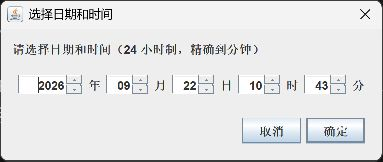

# Git 课堂练习完成记录

完成日期：2026-09-22。GitHub 账号：`sophiasu051119-glitch`。

仓库：https://github.com/sophiasu051119-glitch/git-test （公开）

仓库最初以私有方式创建，随后按用户要求改为公开，便于老师查看。

本练习通过 Codex 对话完成，代替截图中的 Trae。截图未提供 Java 源码模板，因此编写了可独立运行的 Swing 日期时间选择器。

## 逐项结果

| 课堂要求 | 实际完成情况 |
| --- | --- |
| 1. 在 GitHub 创建 git-test | 已在本人账号下创建仓库，以 README 初始化；创建时为私有，随后按用户要求改为公开 |
| 2. clone 到本地 | 已从 GitHub 克隆到本次任务的 `outputs/git-test` |
| 3. 根目录创建 Java 文件并添加内容 | 已创建 `DateTimePickerDialog.java`，支持日期时间选择、确认与取消 |
| 4. add、commit，自动生成提交信息 | 已暂存并提交，提交信息由 Codex 根据改动生成 |
| 5. push 到远程 | 程序提交 `54ef28d` 已成功推送到 `origin/main` |
| 6. reset 回退到修改前 | 在 `reset-demo` 分支修改窗口标题并提交，再实际执行 `git reset --hard` 恢复，文件内容核对一致 |
| 7. 通过 AI 对话进行版本操作 | 建仓、克隆、编写、提交、推送与回退均通过本次 Codex 对话执行 |

## 提交与回退证据

| 版本 | 提交 | 用途 |
| --- | --- | --- |
| 初始版本 | `e50f0c72e6b43cf5a91a45eae9ff2c7aa48ea90e` | GitHub 初始化 |
| 程序完成版本 | `54ef28d6211fa8c48757a4268dabd5d52f38f956` | 添加 Java 程序及运行说明，已推送 |
| 临时修改版本 | `6e8613f526ff7607f29c6e49f0362fd3c3140002` | 将窗口标题改为“选择日期和时间（回退演示）” |
| reset 后版本 | `54ef28d6211fa8c48757a4268dabd5d52f38f956` | 窗口标题恢复为“选择日期和时间” |

临时修改版本保留在标签 `before-reset-demo` 中；`reset-demo` 分支保留回退后的状态。主分支保留可运行程序和这份记录。

关键操作（已实际执行，以下为整理后的命令）：

```sh
git clone https://github.com/sophiasu051119-glitch/git-test.git outputs/git-test
cd outputs/git-test
git add DateTimePickerDialog.java README.md .gitignore
git commit -m "feat: add standalone Java date-time picker and usage guide"
git push -u origin main
git switch -c reset-demo
# 修改 DateTimePickerDialog.java 的窗口标题后：
git add DateTimePickerDialog.java
git commit -m "demo: change dialog title before reset"
git tag before-reset-demo 6e8613f526ff7607f29c6e49f0362fd3c3140002
git reset --hard 54ef28d6211fa8c48757a4268dabd5d52f38f956
git switch main
```

回退只在本次新建的练习分支、工作区干净且临时提交已保留标签时执行，没有改写远程主分支历史。`reset --hard` 会丢弃未提交修改，不应直接用于有其他未保存工作的仓库。

本地真实 reflog 摘录：

```text
54ef28d HEAD@{2026-09-22 10:41:35 +0800}: reset: moving to 54ef28d6211fa8c48757a4268dabd5d52f38f956
6e8613f HEAD@{2026-09-22 10:41:35 +0800}: commit: demo: change dialog title before reset
54ef28d HEAD@{2026-09-22 10:41:35 +0800}: checkout: moving from main to reset-demo
54ef28d HEAD@{2026-09-22 10:40:23 +0800}: commit: feat: add standalone Java date-time picker and usage guide
e50f0c7 HEAD@{2026-09-22 10:39:17 +0800}: clone: from https://github.com/sophiasu051119-glitch/git-test.git
```

回退前基准文件与回退后文件的 Git blob 标识均为：

`5c594b6e679518b947995e3f1043aec03b115465`

因此已核实文件内容完全恢复。GitHub 不保存本机 reflog，这份记录保留了执行证据。

## 程序验证

- 使用本机 JDK 21、`--release 8` 编译成功，兼容 Java 8。
- 编译检查未发现源码警告。
- 无界面自检通过 9 项检查：闰年、平年、月份天数、有效日期保持、显示格式、分钟精度，以及非法日期、小时和分钟的拒绝。
- 自检输出：`PASS: 9 date/time checks`。
- 已实际启动桌面窗口并检查显示，运行截图如下（截图仅证明窗口显示，不代表完整交互测试）：



正常运行与自检方式见 [README.md](README.md)。
